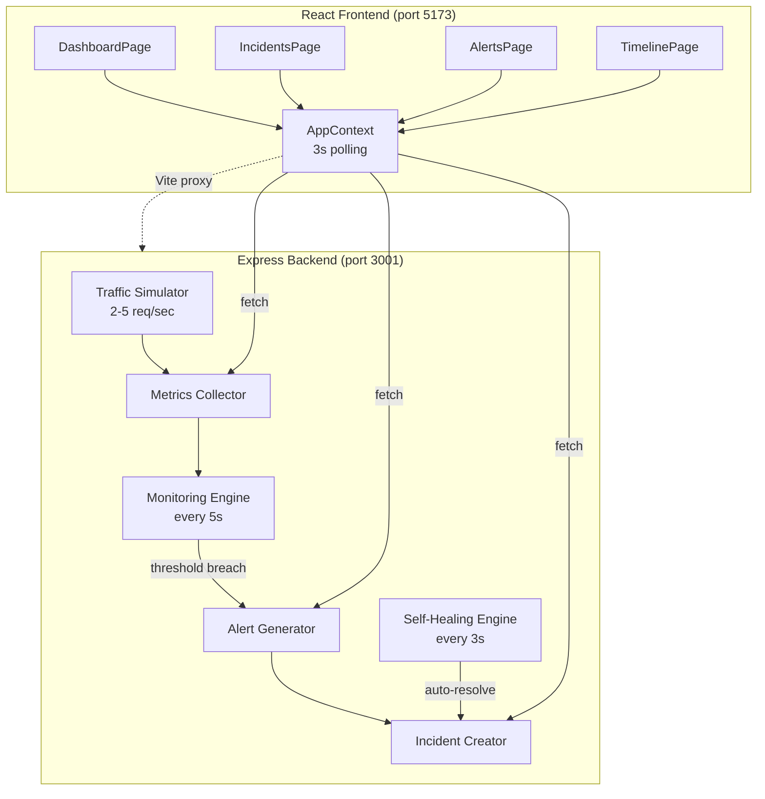

# Sentinel v2.0 — Full-Stack SRE Incident Management Dashboard

A production-style incident management system with **real-time metrics**, **automated alerting**, **auto-healing**, and **live chaos injection** — built with React + Express.

---

## 🚀 Running the App

```bash
cd "d:\SRE\Mini Project"
npm run dev
```

Opens **backend (port 3001)** + **frontend (port 5173)** concurrently.

---

## 🏗 Architecture



## 📁 File Structure

```
├── backend/
│   └── server.js           # Express server — single source of truth
├── src/
│   ├── context/
│   │   └── AppContext.jsx   # API polling + state management (zero mock data)
│   ├── data/
│   │   └── constants.js     # Shared enums (SEVERITIES, STATUSES)
│   ├── pages/
│   │   ├── DashboardPage    # Live metrics, charts, service status
│   │   ├── IncidentsPage    # Backend incident list + manual create
│   │   ├── IncidentDetailPage # Timeline, edit, resolve
│   │   ├── AlertsPage       # Real alerts from monitoring engine
│   │   ├── TimelinePage     # Chronological lifecycle view
│   │   └── LoginPage        # Team fetched from /api/team
│   └── components/          # Header, Sidebar, ToastContainer
├── package.json             # Scripts: `npm run dev` starts both
└── vite.config.js           # Proxy rules → backend
```

## 📡 API Endpoints

| Method | Endpoint | Description |
|--------|----------|-------------|
| `GET` | `/` | Health check |
| `GET` | `/api/team` | Team members list |
| `GET` | `/metrics` | Real-time metrics |
| `GET` | `/incidents` | All incidents |
| `POST` | `/incidents` | Create incident manually |
| `PATCH` | `/incidents/:id` | Update status/severity/assignee |
| `GET` | `/alerts` | Triggered alerts |
| `POST` | `/simulate` | Inject chaos (spike errors + latency) |
| `GET` | `/api/services` | Service health statuses |

## 🔄 SRE Lifecycle

1. **Normal** — Traffic flows at ~10% error rate, 350ms latency
2. **Chaos Injected** — `POST /simulate` spikes failure rate + latency
3. **Alert Triggered** — Monitoring detects error >20% or latency >1000ms
4. **Incident Created** — Each alert creates exactly ONE incident (strict dedup)
5. **Investigating** — Self-healing transitions Open → Investigating (15-25s)
6. **Resolved** — Auto-resolved with timeline entries (20-33s from creation)
7. **Recovery** — Failure rate + latency reduced, system returns to normal

## ✅ Key Design Decisions

- **Backend is single source of truth** — all data from API, zero mock imports
- **Stable heal timers** — `healAt`/`resolveAt` set once at creation (no randomization drift)
- **Strict dedup** — `activeAlertTypes` Set prevents duplicate alerts for same condition
- **systemHealth driven by backend** — `operational | degraded | outage` based on active incidents
- **3-second polling** — frontend fetches all endpoints in parallel, uses refs to avoid stale closures
